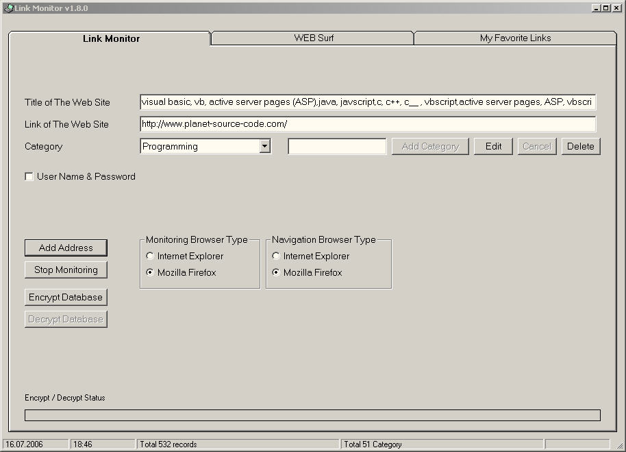



## Link Monitor

### Description

This program monitors internet browsers and extracts current web addresses from them by DDE (dynamic data exchange) technology.
 
### More Info
 

             |
---                |---
**Submitted On**   |2006-06-17 16:59:54
**By**             |[Ferhat Nutku](https://github.com/Planet-Source-Code/PSCIndex/blob/master/ByAuthor/ferhat-nutku.md)
**Level**          |Advanced
**User Rating**    |5.0 (20 globes from 4 users)
**Compatibility**  |VB 6\.0
**Category**       |[Internet/ HTML](https://github.com/Planet-Source-Code/PSCIndex/blob/master/ByCategory/internet-html__1-34.md)
**World**          |[Visual Basic](https://github.com/Planet-Source-Code/PSCIndex/blob/master/ByWorld/visual-basic.md)
**Archive File**   |[Link\_Monit2001316162006\.zip](https://github.com/Planet-Source-Code/ferhat-nutku-link-monitor__1-63540/archive/master.zip)

